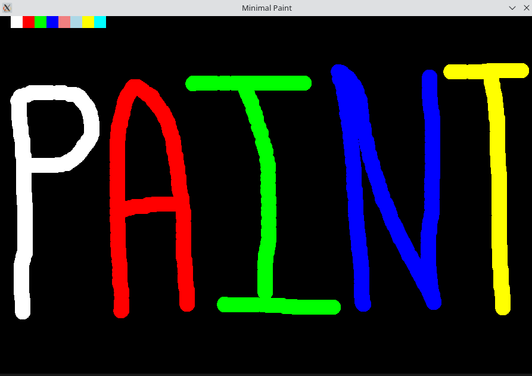

# 🎨 Minimal Paint

A lightweight paint application built using SDL3 in C, featuring direct surface rendering for low-level graphics learning.



## 📌 Overview

A simple Microsoft Paint like application built in C using SDL3 Multimedia Library. It uses low level APIs provided by SDL to directly access pixels and colour them. This is project is only for learning purpose.

## 🚀 Features

- 🖱️ **Freehand Drawing** - Draw smooth circles with mouse drag
- 🎨 **Color Palette** - Select from a variety of colors in the top bar
- 🖌️ **Adjustable Brush Size** - Zoom in/out using mouse wheel
- 🪟 **Clean Interface** - 900x600 pixel canvas with intuitive controls
- ⚡ **Real-time Rendering** - Direct surface manipulation for responsive drawing
- 💾 **Save Drawing** - Use CTRL+S to save the surface as a raw ppm image.

## 🎮 Controls

| Action | Input |
|--------|-------|
| Draw | Left Mouse Button (Hold + Drag) |
| Select Color | Click on top color palette |
| Increase Brush Size | Mouse Wheel Up |
| Decrease Brush Size | Mouse Wheel Down |
| Quit | Close Window |

## 🏗️ Project Structure

```
paint/
├── images/                   # Contains screenshots of implementation
├── paint.exe                 # An executable file for linux
├── paint                     # An executable file for Windows
├── paint.c                   # Main application source code
└── README.md                 # Project documentation
```

## ⚙️ Installation & Build

### Prerequisites

- C compiler (GCC, Clang, or MSVC)
- SDL3 library installed
- libtinyfiledialogs
- zenity (required to open Save File Dialogue box on linux distributions)

### 🐧 Linux

#### Install SDL3

```bash
# Ubuntu/Debian
sudo apt-get install libsdl3-dev

# Arch Linux
sudo pacman -S sdl3

# From source
git clone https://github.com/libsdl-org/SDL.git
cd SDL
mkdir build && cd build
cmake ..
make
sudo make install
```

#### Build and Run

```bash
gcc main.c -o paint -lSDL3
./paint
```

If SDL3 is installed in a custom location:

```bash
gcc main.c -o paint -I/path/to/SDL3/include -L/path/to/SDL3/lib -lSDL3
```

```bash
keep libtinyfiledialogs in the same folder as that of project ( recommanded )
```

### 🪟 Windows

#### Using MinGW-w64

1. Download SDL3 development libraries from [libsdl.org](https://www.libsdl.org/)
2. Extract to `C:\SDL3` (or preferred location)
3. Build:

```bash
gcc main.c -o paint.exe -IC:/SDL3/include -LC:/SDL3/lib -lSDL3
```

4. Copy `SDL3.dll` to the same directory as `paint.exe` or add to PATH

#### Using Visual Studio

```bash
cl main.c /I"C:\SDL3\include" /link /LIBPATH:"C:\SDL3\lib" SDL3.lib
```

### 🍎 macOS

```bash
# Using Homebrew
brew install sdl3

# Build
gcc main.c -o paint -lSDL3
./paint
```

## 🧠 How It Works

### Architecture

The application uses SDL3's surface-based rendering approach:

1. **Surface Creation** - Uses `SDL_GetWindowSurface()` for direct pixel access
2. **Pixel Manipulation** - Draws using `SDL_FillSurfaceRect()` for efficiency
3. **Circle Algorithm** - Implements the mathematical distance formula:
   
   ```
   (x - center_x)² + (y - center_y)² ≤ radius²
   ```

4. **Color Mapping** - Converts RGB values using `SDL_MapRGBA()` with surface format
5. **Event Handling** - Processes mouse and keyboard events in the main loop

### Key Code Concepts

## 🔮 Future Development

### Planned Features

#### Add Undo/Redo features

### Additional Enhancement Ideas

- 🧽 **Clear Canvas** - Reset drawing area
- ⬛ **Eraser Tool**  - Remove drawn content
- 🖼️ **Load Images**  - Import background images
- 💾 **Save as PNG**  - Using SDL_image library
- 🔍 **Zoom Tool**    - Canvas magnification

## 🤝 Contributing

Contributions are welcome! Here's how you can help:

1. Fork the repository
2. Create a feature branch (`git checkout -b feature/amazing-feature`)
3. Commit your changes (`git commit -m 'Add amazing feature'`)
4. Push to the branch (`git push origin feature/amazing-feature`)
5. Open a Pull Request

## 🔧 Troubleshooting

### SDL3 not found

```bash
# Linux: Update library cache
sudo ldconfig

# Set LD_LIBRARY_PATH
export LD_LIBRARY_PATH=/usr/local/lib:$LD_LIBRARY_PATH
```

### Linking errors on Windows

Ensure `SDL3.dll` is in:
- Same directory as executable
- System32 folder
- A directory in your PATH

```bash
gcc -Wall -Wextra main.c -o paint -lSDL3
```

## 👨‍💻 Author

**Abhay Rao**

- 💼 GitHub: [@arao1118](https://github.com/arao1118)

## 📚 Resources

- [SDL3 Documentation](https://wiki.libsdl.org/SDL3/)
- [Lazy Foo's SDL Tutorials](https://lazyfoo.net/tutorials/SDL/)
- [Graphics Programming Basics](https://www.scratchapixel.com/)

## ⭐ Show Your Support

If you find this project helpful, please consider:

- ⭐ Starring the repository
- 🐛 Reporting bugs and issues
- 💡 Suggesting new features
- 🔀 Contributing code improvements

---

**Built with ❤️ using SDL3 and C**
